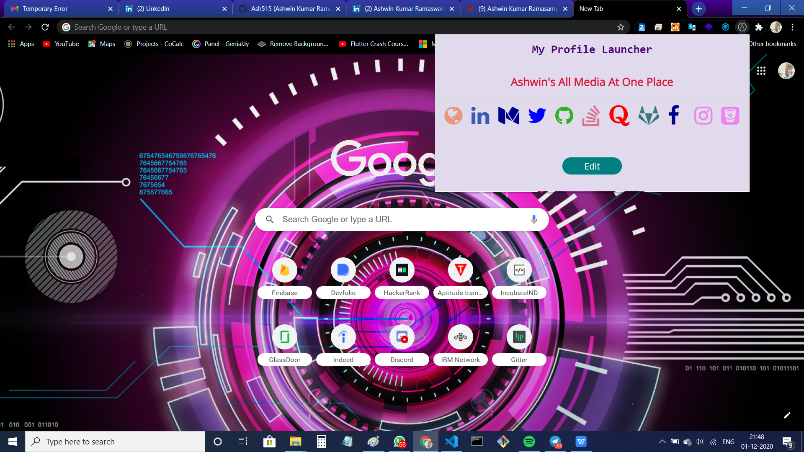

# Social Media Connection 👨‍💻

A chrome extension which useful to access our social media profiles easily.🤟📱

## Features 
- Website
- Facebook
- Linkedin
- Github
- Quora, Stack overflow
- Instagram
- Twitter
- Gitlal, Bitbuck.

## Video Demo
[Social Media Connection](https://www.youtube.com/watch?v=_kaKUzQTMuY&t=54s)

## Image Output




## Installation 
1. Clone the repository 
```
https://github.com/Ash515/SocialMediaConnection.git
```
2. Check the status of your file 
```
$git status
```
3. For using VScode for editing your files 
```
$git code .
```
4. To directly add your files to github
```
$git add .
```
5. After writing your code commit your changes 
```
$git commit -m  <message>
```
6. To pull your code to reposoitory
```
$git push origin master
```
Thats all about installation and version control with **Git**

## Licence
MIT

# Developer ❤
[Ashwin kumar Ramaswamy](https://github.com/Ash515)


